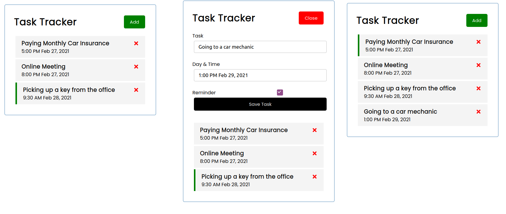

# WebTaskManager
> A simple React-based webpage to manage tasks



## Features

* Add a new Task
* Delete a Task
* Highlight a Task as the reminder Task by double-click
* Some validations to input

## Installation

Clone this repository first

```sh
npm install
```

## Development setup

```sh
npm start
```

## Release History

* 0.1.0
    * The first proper release

## LICENSE

Distributed under the MIT license. See ``LICENSE`` for more information.

## ThanksTo
Thanks to @bradtraversy's awesome react tutorial - [Link](https://github.com/bradtraversy/react-crash-2021)
